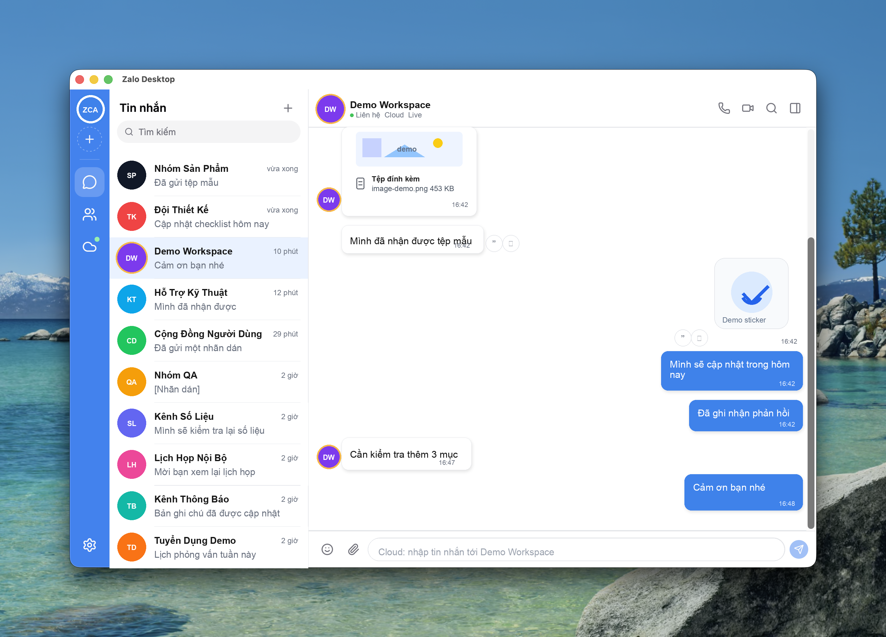

# zca-desktop

Unofficial cross-platform **Zalo desktop client** built with **Tauri v2, Rust,
SvelteKit, and Svelte 5**. The desktop core hosts concurrent
[`zca-rust`](https://github.com/tuanle96/zca-rust) sessions, while an optional
Rust cloud backend can host QR-linked Zalo sessions, encrypted sync state, and
media storage for personal self-hosted use.



> **Unofficial. Not affiliated with Zalo or VNG.** This is a personal-use,
> noncommercial project. Using an unofficial client can get your Zalo account
> rate-limited, suspended, or permanently banned, and may violate Zalo's Terms
> of Service. Read [DISCLAIMER.md](./DISCLAIMER.md) before using it with any
> account you care about.

## Current status

The project is early but functional. Local desktop chat, multi-account session
management, QR login, encrypted credential storage, SQLite history restore, and
the self-hosted cloud backend are implemented and tested. Some media delivery
and packaging work is still in progress; see [Roadmap](#roadmap).

## Implemented

### Desktop local mode

| Area | Status | Notes |
| --- | --- | --- |
| Tauri desktop shell | Implemented | Tauri v2 app with SvelteKit/Svelte 5 UI and Tailwind v4 styling. |
| Zalo login | Implemented | QR login flow streams non-secret QR progress to the UI; credential material stays in Rust. |
| Dev credential loader | Implemented | Optional local `.zalo-cred.json` loader for development; the webview never receives the token values. |
| Multi-account sessions | Implemented | `SessionManager` owns one authenticated API + realtime listener per account with graceful replacement/removal. |
| Realtime messages | Implemented | Listener emits `zalo://message` events and tags messages with `account_id` for per-account routing. |
| Account switcher | Implemented | Left rail lists logged-in accounts, status, unread totals, and switches active account state. |
| Multi-device self-listen | Implemented | Messages sent from another official Zalo device render as outgoing messages in zca-desktop. |
| Text messaging | Implemented | Send text messages and quoted replies to user/group threads through the active account session. |
| Rich messages | Implemented | Stickers, sticker search/recent packs, reactions, quotes, link previews, recalled/deleted state, and persistence. |
| Contacts and groups | Implemented | Friend/contact list and group metadata are loaded through the core and used to backfill thread identity. |
| Local persistence | Implemented | SQLite stores accounts, threads, messages, rich metadata, attachments metadata, and recent stickers. |
| Credential storage | Implemented | Zalo credentials are encrypted before persistence; the master key is stored in the OS keychain. |
| Session restore | Implemented | Saved accounts are restored on startup; expired credentials are marked reauth-needed. |
| Settings panel | Implemented | Account info, logout/forget account, theme selection, local data stats, and about panel. |

### Self-hosted cloud mode

| Area | Status | Notes |
| --- | --- | --- |
| Backend foundation | Implemented | Rust `axum` server, Postgres via `sqlx`, S3-compatible object storage, migrations, and API contracts. |
| Email magic-link auth | Implemented | Device registration, recovery-key wrapping, token hashing, revoke support, rate limits, and audit events. |
| Hosted Zalo sessions | Implemented | Backend QR/login/listen/send worker per hosted account with encrypted credential restore. |
| Desktop cloud commands | Implemented | Tauri command bridge for cloud auth, account management, realtime, contacts, conversations, and messages. |
| Realtime SSE | Implemented | Per-user realtime stream with reconnect/offline UI handling and ownership isolation. |
| Cloud contacts | Implemented | Hosted contacts endpoint and desktop contact pane in cloud mode. |
| Cloud message store | Implemented | Encrypted message fields and file metadata across registered devices. |
| Media mirroring | Implemented | Bounded HTTP(S) media fetch, encrypted object-store writes, and desktop download hydration. |
| Cloud rich messages | Implemented | Quote, link, sticker, file/media preview, reactions, and deleted state hydrate in desktop cloud mode. |
| Cloud upload flow | Implemented with caveat | Encrypted upload, ownership validation, and desktop flow are wired; image/file delivery semantics still need final live hardening. |

### Safety and project hygiene

| Area | Status | Notes |
| --- | --- | --- |
| Secret handling | Implemented | Zalo `imei`, cookies, user-agent, device tokens, and server secrets are treated as bearer credentials. |
| Redaction | Implemented | Raw API logging redacts common token/cookie fields by default; `ZCA_LOG_RAW=1` is local-debug only. |
| Public docs | Implemented | Architecture, credential handling, privacy, deployment, and threat-model docs are included. |
| Harness gates | Implemented | Root harness scripts, Codex instructions, GitHub workflows, task evidence, and readiness checks are wired. |
| License posture | Implemented | PolyForm Noncommercial 1.0.0; commercial use is not permitted without a separate license. |

## Not implemented yet

- **Local desktop attachment sending**: image/file upload and rendering in local
  mode is still a roadmap item.
- **Hosted attachment delivery hardening**: cloud upload/storage exists, but
  recipient delivery for some media paths still needs final live proof and fixes.
- **Signed app distribution**: the macOS universal DMG is published, signed, and
  notarized; Windows and Linux installers are still roadmap items.
- **Deep device-coexistence proof**: the app is designed to coexist with other
  Zalo devices and self-listen is enabled, but broader multi-device validation is
  still planned.
- **Production operations**: the cloud backend has a deployment checklist, but no
  hosted public service is provided by this repository.

## Roadmap

### Near term

- Finish local desktop attachment upload/rendering.
- Finalize hosted image/file delivery semantics and live proof for cloud
  attachment sends.
- Improve cloud account reauth UX when hosted credentials expire or Zalo rejects
  a restored session.
- Add more focused tests around rich-message hydration, media previews, and
  device revocation flows.

### Mid term

- Package signed desktop builds for Windows and Linux using Tauri bundling.
- Add optional updater plumbing after signed builds are reliable.
- Expand multi-device coexistence testing across phone, web, and desktop Zalo
  sessions.
- Improve cloud deployment templates for production-grade Postgres, object
  storage, SMTP, HTTPS, backups, and log rotation.

### Later / exploratory

- Optional self-hosted relay/sync model for same-account state across multiple
  zca-desktop installs.
- More complete data export/delete tooling for self-hosted cloud operators.
- A stricter public API compatibility workflow around `crates/zca-types` and the
  generated TypeScript contracts.

## Stack

- **Desktop core**: Rust + Tauri v2, layered as
  `types -> config -> store -> zalo -> session -> command`.
- **Zalo adapter**: [`zca-rust`](https://github.com/tuanle96/zca-rust), pinned to
  a known revision for reproducible builds.
- **Desktop UI**: SvelteKit/Svelte 5 SPA, Tailwind v4, shadcn-svelte style
  primitives.
- **Cloud backend**: Rust `axum`, `sqlx`, Postgres, S3-compatible object storage,
  server-sent events.
- **Shared contracts**: Rust DTOs in `crates/zca-types`, generated TypeScript in
  `packages/types`.
- **Package manager**: `bun`.

## Quick start

Prerequisites:

- [Rust](https://rustup.rs)
- [bun](https://bun.sh)
- [Tauri v2 system dependencies](https://v2.tauri.app/start/prerequisites/)
- Docker, if you want the local cloud backend stack

```bash
# 1. Install workspace dependencies
bun install

# 2. Optional but recommended: start the local cloud backend
#    Postgres + MinIO + MailHog + zca cloud server at http://127.0.0.1:37880
docker compose -f apps/server/docker-compose.dev.yml up -d --build

# 3. Run the desktop app
bun --cwd apps/desktop run tauri dev
```

The current default sign-in path uses the local backend from step 2 for
magic-link/device auth. See [apps/server/README.md](./apps/server/README.md) for
backend-specific setup, environment variables, and deployment notes.

## Development commands

```bash
# Desktop frontend
bun --cwd apps/desktop run check
bun --cwd apps/desktop run build

# Mobile frontend
bun --cwd apps/mobile run check
bun --cwd apps/mobile run build

# Rust client workspace
cargo clippy --all-targets -- -D warnings
cargo test --all

# Cloud backend workspace
cargo clippy --manifest-path apps/server/Cargo.toml --all-targets -- -D warnings
cargo test --manifest-path apps/server/Cargo.toml

# Shared Rust -> TypeScript contract generation
cargo test --manifest-path crates/zca-types/Cargo.toml --features ts
git diff --exit-code -- packages/types/src/generated
```

## Operational docs

- [Architecture](./docs/ARCHITECTURE.md)
- [Credential handling](./docs/CREDENTIALS.md)
- [Privacy and data handling](./docs/PRIVACY.md)
- [Deployment checklist](./docs/DEPLOYMENT.md)
- [Threat model](./docs/THREAT_MODEL.md)
- [Server README](./apps/server/README.md)

## Contributing

Contributions are welcome, especially bug fixes, tests, docs, and narrowly
scoped hardening work. Please read [CONTRIBUTING.md](./CONTRIBUTING.md) first.

In short:

- Every contributor must agree to the [Contributor License Agreement](./CLA.md)
  and sign off their commits (`git commit -s`).
- Be respectful; see the [Code of Conduct](./CODE_OF_CONDUCT.md).
- Do not add spam-like, mass-messaging, scraping, or bulk automation features.
- Never commit Zalo credentials, cookies, tunnel credentials, server secrets, or
  raw unredacted debug captures.

Found a security or credential-handling issue? Report it privately through the
process in [SECURITY.md](./SECURITY.md). Do not open a public issue containing
credentials, cookies, private messages, or infrastructure secrets.

## License

zca-desktop is licensed under the
**[PolyForm Noncommercial License 1.0.0](./LICENSE)**.

- Free for personal, hobby, educational, research, and other noncommercial use.
- Commercial use is not permitted under this license.

If you need a commercial license, contact the maintainer. See [LICENSE](./LICENSE),
[DISCLAIMER.md](./DISCLAIMER.md), and the
[PolyForm FAQ](https://polyformproject.org/licenses/) for details.
